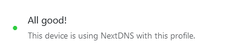

# NextDNS setup guide

[:material-shield: NextDNS](https://nextdns.io/) is a DNS service that can be used to block ads, trackers, malware, etc. This guide will help you set up your NextDNS configuration. You [do not have to sign up](#trying-out-nextdns) for NextDNS to follow this guide.
<!-- more -->
??? info "This guide is **NOT** sponsored by NextDNS."
    No affiliate links are used in this guide. Except [this one](https://nextdns.io/?from=d93f6mm7).

## What does it do?

The key feature of NextDNS is its ability to block ads and trackers at the DNS level. It is highly customizable and you can block anything you want. It is a cloud-based alternative to [Pi-hole](https://pi-hole.net/), which is a self-hosted DNS server that can also block ads and trackers.

Blocking trackers at the DNS level ensures that they are blocked not only in your browser (like how an adblock would do), but also across all the apps on your device. It will reduce your data usage and improve your privacy.

## My experience with NextDNS

I have been using NextDNS as my DNS provider for the past few years, and I am satisfied with it. I've never subscribed for their premium tiers yet, as their generous free tier has been sufficient for me.

Their uptime may be a tad bit little lower than [Google Public DNS](https://dns.google/) and [Cloudflare DNS](https://1.1.1.1/), and their latency may be on the higher side, but the features they provide more than makes up for these drawbacks.

## Trying out NextDNS

!!! warning "Agree to the [Privacy Policy](https://nextdns.io/privacy) of NextDNS before using it."
    Don't worry, it's not long and complicated. Actually, it's pretty short and easy to understand.

You don't have to sign up for NextDNS to give it a try. Use the [link on their homepage](https://my.nextdns.io/start) to create a temporary configuration to play around with. This whole guide can be followed without signing up for a NextDNS account.

## Setting up NextDNS

After creating your first configuration (`My First Profile`), you'll be presented with the DNS endpoints to use. They provide a setup guide for popular platforms at the bottom of the page, be sure to check that out. After successfully setting up NextDNS, you'll see this on the top of the page:

<figure markdown>
  
</figure>

Let's move on to customization. I will give you recommendations on what to enable and what to disable, but play around with the settings and see what works best for you.

### Security

#### :fontawesome-solid-toggle-on: Threat Intelligence Feeds

I recommend enabling this. The list of domains blocked by this option is not publicly available.

#### :fontawesome-solid-toggle-off: AI-Driven Threat Detection

This option has caused some false positives (blocking websites that are not actually malicious) for me. Since this is a beta feature, I don't recommend enabling this. But play around with it and see if it works for you.

#### :fontawesome-solid-toggle-on: Google Safe Browsing

[Google Safe Browsing](https://safebrowsing.google.com/) is a blacklist of URLs with [malware](https://en.wikipedia.org/wiki/Malware) or [phishing](https://en.wikipedia.org/wiki/Phishing) content. Most major browsers rely on this blacklist to warn users about potentially dangerous websites. Since the blocking is done at the DNS level, your IP address is never shared with Google. I highly recommend enabling this.

#### :fontawesome-solid-toggle-on: Cryptojacking Protection

[Cryptojacking](https://en.wikipedia.org/wiki/Cryptojacking) involved the exploitation of your machine to mine cryptocurrencies. This option has never caused any false positives for me. I recommend turning this on.

#### :fontawesome-solid-toggle-on: DNS Rebinding Protection

NextDNS protects against [DNS rebinding](https://en.wikipedia.org/wiki/DNS_rebinding) attacks by not resolving domain names to a private IP address (like `10.0.0.1`). While this may potentially interfere with your network configuration, in most cases, enabling this feature should not cause any issues.

#### :fontawesome-solid-toggle-on: IDN Homograph Attacks Protection

An [IDN Homograph attack](https://en.wikipedia.org/wiki/IDN_homograph_attack) is a way to trick users into visiting a fake website that looks like a real one, by using different characters that look very similar to the ones in the original domain name.

#### :fontawesome-solid-toggle-on: Typosquatting Protection

[Typosquatting](https://en.wikipedia.org/wiki/Typosquatting) relies on mistakes that users make when typing an URL into their browser, such as misspelling the name, using a wrong top-level domain, etc. If enabled, NextDNS will block domains registered by malicious actors that are similar to popular domains. I recommend leaving this on.

#### :fontawesome-solid-toggle-on: Domain Generation Algorithms (DGAs) Protection

A DGA is a technique used by malicious actors to generate a large number of domain names that can be used for malicious purposes. This option blocks domains generated by DGAs. I recommend leaving this on.

#### :fontawesome-solid-toggle-on: Block Newly Registered Domains (NRDs)

Enabling this option will block domains registered less than 30 days ago. NRDs are often malicious but may also be used by legitimate websites. Turning this on may cause some false-positives.

#### :fontawesome-solid-toggle-off: Block Dynamic DNS Hostnames

[Dynamic DNS](https://en.wikipedia.org/wiki/Dynamic_DNS) is a method that allows users to assign a static hostname to a dynamic IP address. Since this is a beta feature, this may cause some false-positives. I recommend leaving this off.

#### :fontawesome-solid-toggle-on: Block Parked Domains

Most of the time, parked domains do not provide any useful content. I recommend enabling this.

#### Block Top-Level Domains (TLDs)

This option allows you to block entire TLDs. Some TLDs are known to be extensively abused by malicious actors. According to [this alternative guide](https://github.com/yokoffing/NextDNS-Config#block-top-level-domains-tlds-1-2-3-4-5-), the following TLDs have no legitimate uses and are good candidates for blocking:

```plaintext
.cfd
.discount
.gdn
.loan
.loans
.ooo
.sbs
.zip
```

#### :fontawesome-solid-toggle-on: Block Child Sexual Abuse Material

According to NextDNS, this option will block domains hosting child sexual abuse material (CSAM) with the help of [Project Arachnid](https://projectarachnid.ca/en/), operated by the Canadian Centre for Child Protection. I recommend enabling this.

### Privacy

#### Blocklists

Blocklists are lists of domains that are blocked by NextDNS. Some blocklists are aggressive and may cause false-positives. For minimal false-positives, I recommend using the following blocklists:

- NextDNS Ads & Trackers Blocklist
- AdGuard DNS filter
- OISD
- HaGeZi - Multi LIGHT1

If you want more trackers/ads blocked, you can enable more blocklists at the cost of more false-positives.

#### Native Tracking Protection

Native Tracking Protection blocks trackers that operate on the operating system level. Add the brands of all the devices you own. It is recommended to add all the everything even though you don't own them.

#### :fontawesome-solid-toggle-on: Block Disguised Third-Party Trackers

Some third-party trackers disguise themselves as first-party to trick adblockers. This option blocks such trackers and I recommend enabling this.

#### :fontawesome-solid-toggle-off: Allow Affiliate & Tracking Links

I like to keep this disabled because I seldom use affiliate links. Enable this if you have problem opening links from emails.

### Parental Control

This section may be particularly useful for parents. I'm not a parent, so I don't know.

#### :fontawesome-solid-toggle-off: Block Bypass Methods

I recommend leaving this off as enabling this may break some websites. Your tech savvy kids will find a way to bypass this anyway.

### Denylist

Adding a domain on the denylist will cause NextDNS to block it and all its subdomains.

### Allowlist

Anything on the allowlist will not get blocked by NextDNS regardless of the blocklists you have enabled. You may want to add domains that are critical, like government websites, your bank's website, etc. just to be safe. If you chose only the blocklists I recommended, you should be fine.

### Settings

#### Logs

I personally don't like my DNS queries being logged, so I have this turned off. I recommend turning this on for a few days to see the analytics of your DNS queries and enjoy the pretty graphs.

If you decide to turn this on, choose Switzerland as your storage location because of their strong privacy laws.

#### Block page

If you enable this, you'll see a beautiful block page when you try to access a blocked domain. The block page also shows the blocklists that blocked the domain, which can be useful for troubleshooting.

You'll have to install the [NextDNS Root CA](https://help.nextdns.io/t/g9hmv0a/how-to-install-and-trust-nextdns-root-ca) to see the block page without any warnings.

???+ danger "Know the risks before installing a root certificate."
    Installing a root certificate on your device can be dangerous. If the private key of the root certificate is compromised, the attacker can intercept all your HTTPS traffic. If you do not trust NextDNS, do **NOT** install their root certificate.

    I haven't installed the root certificate on my devices because of the risks involved. I do not recommend installing the root certificate unless you know what you're doing.

    [Check out](https://help.nextdns.io/t/g9hmv0a?r=m1htlfl) what Olivier Poitrey, the founder of NextDNS, has to say about how they protect the private key of their root certificate.

#### Performance

##### :fontawesome-solid-toggle-on: Anonymized EDNS Client Subnet

This does come with a privacy trade-off. If you enable this, NextDNS will be able to see your approximate location. This depends on your threat model.

##### :fontawesome-solid-toggle-on: Cache Boost

When this is enabled, a minimum TTL (Time To Live) of 5 minutes is enforced. This will lower the number of DNS queries made by your device, and will improve the performance.

##### :fontawesome-solid-toggle-on: CNAME Flattening

This will also improve the performace by reducing the number of DNS queries made by your device.

#### Web3

Since this is a beta feature, and I don't use Web3, I have this turned off.

## FAQs

### So, that's it? Is it set-and-forget?

Uhm, depends on how aggressive your blocklists are. You'll probably need to come back to the dashboard once in a while to add domains to the allowlist.

### Why am I still seeing ads?

Some ads are served from the same domain as the content you're trying to access. An example for this is YouTube. If you want to robustly block ads and annoyances, you'll need to use a browser extension. I recommend using [uBlock Origin](https://ublockorigin.com/).

### Any privacy-friendly alternatives to NextDNS?

If you need a self-hosted solution, you can use [Pi-hole](https://pi-hole.net/). If you want a cloud-based solution, you can use [AdGuard DNS](https://adguard-dns.io/).

If you are looking for alternative DNS services that provide malware blocking, you can use [Quad9](https://www.quad9.net/service/service-addresses-and-features) or [Mullvad DNS](https://mullvad.net/en/help/dns-over-https-and-dns-over-tls/), both of which are privacy-friendly.

### Will adding more blocklists increase the latency?

No, it won't. The latency will stay the same regardless of the number of blocklists you have enabled. Don't go on about enabling every blocklist you see, though. That'll only increase the chance of legitimate domains getting blocked.

### Is the free plan enough?

It depends on your usage. I have been using it on most of the devices I own and I haven't hit the free plan's limit yet. The free plan gives you 300k queries per month. If you have a lot of devices, you may want to consider upgrading to a paid plan. Over here in India, the pro plan costs just ₹159 per month. For unlimited queries, that doesn't sound bad at all.

### More questions?

Feel free to shoot quick questions on the comments below. Alternatively, ask them on the [NextDNS Help Center](https://help.nextdns.io/) or on the official [subreddit](https://www.reddit.com/r/nextdns/).